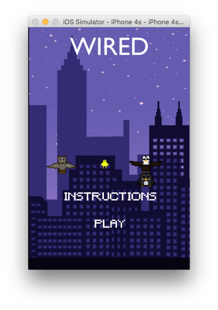
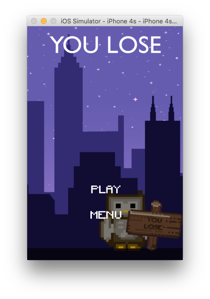

# Wired
## Description
Tap, swipe, and hold to fling birds off of a wire before it breaks! Good luck!!! Xcode mobile app.

# General
## Running/Viewing (Simulation)/Building
for development; takes IOS or Android simulator

## Publishing
- IOS -> Itunes Connect -> IOS App Store -> never
- Android -> Google Play Store Upload -> Google Play Store -> never

## Viewing Live
- IOS Store: never
- Google Play Store: never

## Testing
Catches anything that is incorrect in building.
- IOS simulator (Xcode)
- Android simulator

## Example Images
| O.P | Panel | |
| --- | --- | --- |
| `IOS` | Home |  |
| `IOS` | Introduction |  |
| `IOS` | Game Play |  |
| `IOS` | Game Over |  |

### Updated: 06/09/18
